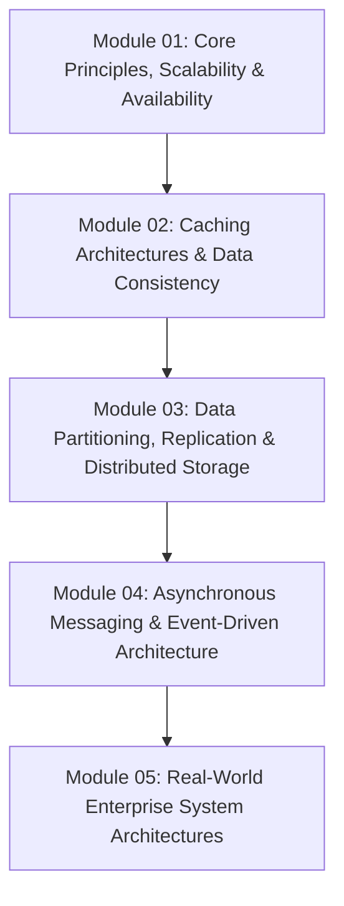

# System Design & Distributed Systems Revision Guide

Chào mừng bạn đến với lộ trình ôn tập và luyện tập chuyên sâu **System Design & Distributed Systems**. Kho tài liệu được thiết kế nhằm trang bị kiến thức kiến trúc hệ thống phân tán cấp độ Senior / Staff / Principal Architect.

---

## 🗺️ Lộ Trình 5 Module Chuyên Sâu

### Chi Tiết Từng Module

1. **[01-core-principles-and-scalability/](file:///d:/my-project/revision-document/system-design/01-core-principles-and-scalability/README.md)**:
   - Mở rộng quy mô: Vertical (Scale-Up) vs Horizontal (Scale-Out).
   - Kiến trúc Stateless vs Stateful, Session Affinity (Sticky Sessions).
   - Toán học độ sẵn sàng (Availability Nines: 99.9% vs 99.999%, Series vs Parallel SLA).
   - Định lý CAP (Consistency, Availability, Partition Tolerance) & PACELC Theorem.
   - Thuật toán Load Balancing (Round Robin, Least Connections, Consistent Hashing Ring & Virtual Nodes).

2. **[02-caching-and-data-consistency/](file:///d:/my-project/revision-document/system-design/02-caching-and-data-consistency/README.md)**:
   - Các tầng Caching (Browser, CDN, API Gateway, App In-Memory, Distributed Redis).
   - Chiến lược Caching: Cache-Aside (Lazy Loading), Read-Through, Write-Through, Write-Behind (Write-Back).
   - Xử lý các sự cố Cache kinh điển: Cache Stampede (Thundering Herd), Cache Penetration (Bloom Filter), Cache Breakdown, Cache Avalanche (Jittered TTL).
   - Chính sách giải phóng bộ nhớ (Eviction Policies): LRU, LFU, FIFO, ARC.

3. **[03-partitioning-and-distributed-storage/](file:///d:/my-project/revision-document/system-design/03-partitioning-and-distributed-storage/README.md)**:
   - Phân mảnh dữ liệu Database Sharding (Range-based, Hash-based, Directory-based).
   - Các mô hình nhân bản (Replication Topologies): Single-Leader, Multi-Leader, Leaderless (Dynamo Quorum $R + W > N$).
   - Hiện tượng trễ replication và các mô hình nhất quán: Read-Your-Writes, Monotonic Reads.
   - Giao dịch phân tán: Two-Phase Commit (2PC) vs Saga Pattern (Orchestration vs Choreography).
   - Khóa phân tán (Distributed Locking): Redlock Algorithm, Fencing Tokens.

4. **[04-messaging-and-event-driven/](file:///d:/my-project/revision-document/system-design/04-messaging-and-event-driven/README.md)**:
   - Message Queues (RabbitMQ) vs Event Streams (Apache Kafka).
   - Kiến trúc nội bộ Kafka: Topics, Partitions, Consumer Groups, Offsets, In-Sync Replicas (ISR).
   - Cam kết phân phối tin nhắn: At-most-once, At-least-once, Exactly-once (Idempotency, Transactional Outbox Pattern, CDC).
   - Event Sourcing & CQRS (Command Query Responsibility Segregation).
   - Điều tiết lưu lượng & Backpressure: Token Bucket, Leaky Bucket, Circuit Breaker Pattern.

5. **[05-real-world-architectures/](file:///d:/my-project/revision-document/system-design/05-real-world-architectures/README.md)**:
   - Thiết kế TinyURL / URL Shortener (Base62 encoding, Twitter Snowflake ID generator, Cache layer).
   - Thiết kế Distributed Rate Limiter (Redis Sliding Window Counter với Lua scripts).
   - Thiết kế Web Crawler quy mô lớn (Frontier Queue, Deduplication Bloom Filter, Politeness).
   - Thiết kế Real-Time Chat & Notification System (WebSockets, Presence Server, Pub/Sub Fanout).
   - Thiết kế Video Streaming Service (Transcoding Pipeline, Adaptive Bitrate HLS/DASH, CDN Edge Caching).

6. **[bytebytego-101/](file:///d:/my-project/revision-document/system-design/bytebytego-101/README.md)**:
   - **ByteByteGo System Design 101 Toàn Tập (Alex Xu)**: Trực quan hóa kiến trúc hệ thống phân tán, Giao thức mạng (REST/GraphQL/gRPC/WebSocket, HTTP/3), Cơ sở dữ liệu (B-Tree vs LSM-Tree), Caching, Đồng thuận phân tán (CAP, Raft, 2PC/Saga), Microservices Patterns (Rate Limiting, Circuit Breaker, Outbox), Bảo mật & Mổ xẻ hệ thống thực tế (Netflix, Uber, Discord, Snowflake).

---

## ⚡ Tiêu Chuẩn Thực Hành

Mỗi module bao gồm:
- Toàn bộ lý thuyết kiến trúc chuyên sâu.
- File code mô phỏng / implementation chạy trực tiếp trên Node.js.
- File `practice.mjs` với 5 bài kiểm tra assertions tự động chấm đạt/hỏng.
