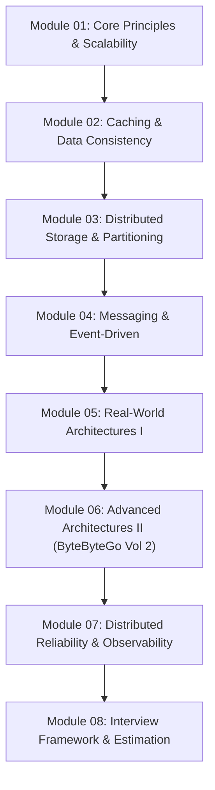

# System Design & Distributed Systems Revision Guide

Chào mừng bạn đến với lộ trình ôn tập và luyện tập chuyên sâu **System Design & Distributed Systems**. Kho tài liệu được thiết kế nhằm trang bị kiến thức kiến trúc hệ thống phân tán cấp độ Senior / Staff / Principal Architect, bám sát các giáo trình kinh điển (ByteByteGo Volume 1 & Volume 2 của Alex Xu, Designing Data-Intensive Applications của Martin Kleppmann, System Design Primer của Donne Martin).

---

## 🗺️ Lộ Trình 8 Module Chuyên Sâu

```mermaid
graph TD
    M1["Module 01: Core Principles & Scalability"] --> M2["Module 02: Caching & Data Consistency"]
    M2 --> M3["Module 03: Distributed Storage & Partitioning"]
    M3 --> M4["Module 04: Messaging & Event-Driven"]
    M4 --> M5["Module 05: Real-World Architectures I"]
    M5 --> M6["Module 06: Advanced Architectures II (ByteByteGo Vol 2)"]
    M6 --> M7["Module 07: Distributed Reliability & Observability"]
    M7 --> M8["Module 08: Interview Framework & Estimation"]
```

### Chi Tiết Từng Module

1. **[01-core-principles-and-scalability/](file:///d:/my-project/revision-document/system-design/01-core-principles-and-scalability/README.md)**:
   - Mở rộng quy mô: Vertical (Scale-Up) vs Horizontal (Scale-Out).
   - Kiến trúc Stateless vs Stateful, Session Affinity (Sticky Sessions).
   - Toán học độ sẵn sàng (Availability Nines: 99.9% vs 99.999%, Series vs Parallel SLA).
   - Định lý CAP (Consistency, Availability, Partition Tolerance) & PACELC Theorem.
   - Thuật toán Load Balancing (Round Robin, Least Connections, Consistent Hashing Ring & Virtual Nodes).

2. **[02-caching-and-data-consistency/](file:///d:/my-project/revision-document/system-design/02-caching-and-data-consistency/README.md)**:
   - Các tầng Caching (Browser, CDN, API Gateway, App In-Memory, Distributed Redis).
   - Chiến lược Caching: Cache-Aside (Lazy Loading), Read-Through, Write-Through, Write-Behind (Write-Back).
   - Xử lý các sự cố Cache kinh điển: Cache Stampede (Thundering Herd), Cache Penetration (Bloom Filter), Cache Breakdown, Cache Avalanche (Jittered TTL).
   - Chính sách giải phóng bộ nhớ (Eviction Policies): LRU, LFU, FIFO, ARC.

3. **[03-partitioning-and-distributed-storage/](file:///d:/my-project/revision-document/system-design/03-partitioning-and-distributed-storage/README.md)**:
   - Phân mảnh dữ liệu Database Sharding (Range-based, Hash-based, Directory-based).
   - Các mô hình nhân bản (Replication Topologies): Single-Leader, Multi-Leader, Leaderless (Dynamo Quorum $R + W > N$).
   - Hiện tượng trễ replication và các mô hình nhất quán: Read-Your-Writes, Monotonic Reads.
   - Giao dịch phân tán: Two-Phase Commit (2PC) vs Saga Pattern (Orchestration vs Choreography).
   - Khóa phân tán (Distributed Locking): Redlock Algorithm, Fencing Tokens.

4. **[04-messaging-and-event-driven/](file:///d:/my-project/revision-document/system-design/04-messaging-and-event-driven/README.md)**:
   - Message Queues (RabbitMQ) vs Event Streams (Apache Kafka).
   - Kiến trúc nội bộ Kafka: Topics, Partitions, Consumer Groups, Offsets, In-Sync Replicas (ISR).
   - Cam kết phân phối tin nhắn: At-most-once, At-least-once, Exactly-once (Idempotency, Transactional Outbox Pattern, CDC).
   - Event Sourcing & CQRS (Command Query Responsibility Segregation).
   - Điều tiết lưu lượng & Backpressure: Token Bucket, Leaky Bucket, Circuit Breaker Pattern.

5. **[05-real-world-architectures/](file:///d:/my-project/revision-document/system-design/05-real-world-architectures/README.md)**:
   - Thiết kế TinyURL / URL Shortener (Base62 encoding, Twitter Snowflake ID generator, Cache layer).
   - Thiết kế Distributed Rate Limiter (Redis Sliding Window Counter với Lua scripts).
   - Thiết kế Web Crawler quy mô lớn (Frontier Queue, Deduplication Bloom Filter, Politeness).
   - Thiết kế Real-Time Chat & Notification System (WebSockets, Presence Server, Pub/Sub Fanout).
   - Thiết kế Video Streaming Service (Transcoding Pipeline, Adaptive Bitrate HLS/DASH, CDN Edge Caching).

6. **[06-advanced-real-world-architectures/](file:///d:/my-project/revision-document/system-design/06-advanced-real-world-architectures/README.md)**:
   - **Proximity Service & LBS**: Geohashing (Base32), QuadTree, Google S2 cells, PostGIS.
   - **Payment System & Digital Wallet**: Kế toán kép (Double-Entry Bookkeeping Ledger), Idempotency Key, Reconciliation Service, PCI-DSS.
   - **Distributed Job Scheduler & Delay Queue**: Kiến trúc 2 tầng (Leader Election vs Worker Pool), Redis ZSET, Hashed Timing Wheel.
   - **Distributed Search Engine**: Apache Lucene Inverted Index, Postings List, Segment Immutability & Merge, Okapi BM25.
   - **Real-Time Gaming Leaderboard & Top-K**: Redis Sorted Set (`ZSET` Skip List), Count-Min Sketch, HeavyKeeper.
   - **Cloud Object Storage (S3)**: Metadata Tier vs Data Chunks, 3-Way Replication vs Erasure Coding (Reed-Solomon $8+4$), Multipart Upload.
   - **Metrics Monitoring & TSDB**: Prometheus Pull vs Datadog Push, Nén Gorilla (Delta-of-Delta & XOR Float64), Downsampling.
   - **Ad Click Aggregator**: Kafka + Flink + ClickHouse, Watermarks, Tumbling/Sliding Windows, Kappa vs Lambda.

7. **[07-reliability-resilience-observability/](file:///d:/my-project/revision-document/system-design/07-reliability-resilience-observability/README.md)**:
   - **Failure Detection & Gossip**: Phi Accrual Failure Detector (Cassandra), Giao thức SWIM (Ping-Req, Suspicion Mechanism), Split-Brain & Fencing Tokens.
   - **Resilience Patterns**: Circuit Breaker (Closed, Open, Half-Open), Bulkhead Pattern, Exponential Backoff với Full Jitter, Load Shedding.
   - **Distributed Tracing & OpenTelemetry**: Ba trụ cột Observability (Metrics, Logs, Traces), Chuẩn W3C `traceparent`, Head-based vs Tail-based Sampling.
   - **Disaster Recovery & Multi-Region Active-Active**: RPO vs RTO, 4 cấp độ DR, Định tuyến Anycast/GeoDNS, Khử xung đột bằng CRDT (PN-Counters).

8. **[08-interview-framework-and-estimation/](file:///d:/my-project/revision-document/system-design/08-interview-framework-and-estimation/README.md)**:
   - **Khung 4 Bước Phỏng Vấn (The Golden 4-Step Blueprint)**: Phân bổ 45 phút, Scope & Clarification, High-level Architecture, Deep-dive Bottlenecks, Wrap-up & Red Flags.
   - **Back-of-the-Envelope Estimation Master Guide**: Bảng lũy thừa 2, quy đổi $1\text{ ngày} \approx 10^5\text{ giây}$, công thức QPS, 5-Year Storage, Băng thông Gbps, Caching 80/20 RAM.
   - **Architecture Patterns & Cheat Sheets**: Cây quyết định chọn CSDL, Ma trận chọn Messaging, Ma trận Caching, Phân cấp nhất quán dữ liệu (Linearizability $\to$ Eventual).

9. **[bytebytego-101/](file:///d:/my-project/revision-document/system-design/bytebytego-101/README.md)**:
   - **ByteByteGo System Design 101 Toàn Tập (Alex Xu)**: Trực quan hóa kiến trúc hệ thống phân tán, Giao thức mạng (REST/GraphQL/gRPC/WebSocket, HTTP/3), Cơ sở dữ liệu (B-Tree vs LSM-Tree), Caching, Đồng thuận phân tán (CAP, Raft, 2PC/Saga), Microservices Patterns (Rate Limiting, Circuit Breaker, Outbox), Bảo mật & Mổ xẻ hệ thống thực tế (Netflix, Uber, Discord, Snowflake).

---

## ⚡ Tiêu Chuẩn Thực Hành

Mỗi module từ 01 đến 08 bao gồm:
- Toàn bộ lý thuyết kiến trúc chuyên sâu bằng tiếng Việt chuẩn mực kèm thuật ngữ công nghiệp quốc tế.
- File code mô phỏng / implementation chạy trực tiếp trên Node.js ES Modules.
- File `practice.mjs` với 5 bài kiểm tra assertions tự động chấm đạt/hỏng (tổng cộng 40 bài test tự động cho toàn bộ giáo trình).
