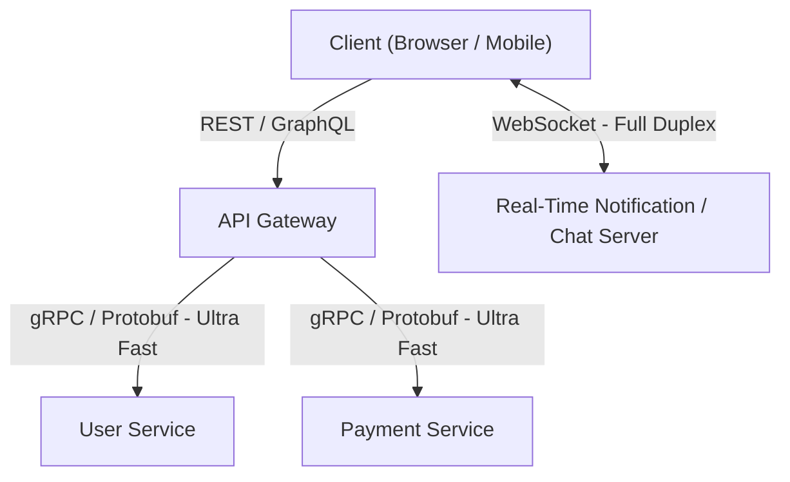

# Bài 1: Giao Thức Mạng & Truyền Thông (Communication Protocols)

> **Trực quan hóa từ ByteByteGo:** So sánh chuyên sâu các giao thức tầng ứng dụng và giao vận: REST vs GraphQL vs gRPC vs WebSocket; Sự tiến hóa từ HTTP 1.1 -> HTTP/2 -> HTTP/3; Bắt tay 3 chiều TCP vs Tốc độ không bắt tay của UDP.

---

## 1. Đại Chiến 4 Giao Thức API: REST vs GraphQL vs gRPC vs WebSocket

| Giao thức | Cơ chế truyền tải | Định dạng dữ liệu | Chiều truyền | Trường hợp sử dụng tối ưu |
| :--- | :--- | :--- | :--- | :--- |
| **REST** | HTTP 1.1 / HTTP/2 | JSON / XML (Text) | Request - Response (Đơn công) | CRUD APIs công khai (Public APIs), dễ dùng, tương thích trình duyệt tốt nhất. |
| **GraphQL** | HTTP POST | JSON (Text) | Request - Response + Subscriptions | Ứng dụng di động cần lấy dữ liệu tùy biến, loại bỏ triệt để Over-fetching và Under-fetching. |
| **gRPC** | **HTTP/2** | **Protocol Buffers (Nhị phân)** | Đơn công hoặc **Song công (Bi-directional Streaming)** | **Giao tiếp nội bộ giữa các Microservices** (Microservices Inter-communication) với độ trễ siêu thấp. |
| **WebSocket** | TCP Socket (Nâng cấp từ HTTP) | Text / Binary | **Song công toàn phần (Full-Duplex)** thời gian thực | Chat trực tuyến, Game nhiều người chơi, Bảng giá chứng khoán, Live Dashboard. |



---

## 2. Sự Tiến Hóa Của HTTP: HTTP 1.1 vs HTTP/2 vs HTTP/3

```
+-------------------------------------------------------------------------+
| HTTP/1.1 (1997) : Văn bản thô, Head-of-Line Blocking ở tầng ứng dụng   |
|   Request 1 ----> Response 1 ----> Request 2 ----> Response 2           |
+-------------------------------------------------------------------------+
| HTTP/2   (2015) : Khung nhị phân (Binary Framing), Đa ghép kênh         |
|   Stream 1 [Header][Data] ===> TCP Connection <=== Stream 2 [Header]    |
|   (Vẫn bị Head-of-Line Blocking ở tầng TCP nếu rớt gói IP!)             |
+-------------------------------------------------------------------------+
| HTTP/3   (2022) : Chuyển dịch sang UDP với giao thức QUIC                |
|   Stream 1 rớt gói KHÔNG ẢNH HƯỞNG Stream 2! 0-RTT Handshake!           |
+-------------------------------------------------------------------------+
```

1. **HTTP/1.1:** Mở nhiều kết nối TCP song song (tối đa 6 kết nối trên 1 domain trong trình duyệt). Gặp lỗi **Head-of-Line (HoL) Blocking** nếu request đầu tiên bị xử lý chậm.
2. **HTTP/2:** Giới thiệu **Multiplexing (Đa ghép kênh)** trên một kết nối TCP duy nhất, **Header Compression (HPACK)** và **Server Push**. Tuy nhiên, nếu tầng TCP bên dưới bị rớt 1 gói IP (Packet Loss), toàn bộ kết nối vẫn phải dừng lại để chờ truyền lại.
3. **HTTP/3:** Thay thế hoàn toàn TCP bằng **QUIC (chạy trên nền UDP)**:
   - Các stream hoàn toàn độc lập ở tầng giao vận: Rớt gói ở Stream A không làm ảnh hưởng đến Stream B.
   - **0-RTT Connection Establishment:** Khởi tạo kết nối an toàn TLS 1.3 ngay trong gói tin đầu tiên, chuyển mạng (Wifi sang 4G) không bị ngắt kết nối nhờ Connection ID.

---

## 3. TCP 3-Way Handshake vs UDP

- **TCP (Transmission Control Protocol):** Hướng kết nối (Connection-oriented), đảm bảo truyền dữ liệu tin cậy 100%, đúng thứ tự, có kiểm soát luồng (Flow Control) và kiểm soát tắc nghẽn (Congestion Control).
  - Bắt tay 3 bước: `SYN` $\rightarrow$ `SYN-ACK` $\leftarrow$ `ACK` $\rightarrow$.
  - Phù hợp: Web, Chuyển tiền ngân hàng, Tải tệp tin, Email.
- **UDP (User Datagram Protocol):** Phi kết nối (Connectionless), "bắn và quên" (Fire and Forget), không bắt tay, không kiểm tra rớt gói.
  - Tốc độ tối đa, độ trễ tối thiểu (Minimal Latency).
  - Phù hợp: Video streaming (Zoom, Meet), Live Gaming, DNS Lookup.
