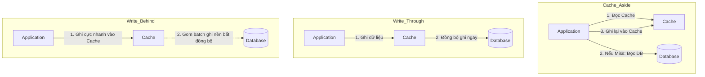

# Bài 3: Caching & Tối Ưu Hóa Tốc Độ (Caching & Performance)

> **Trực quan hóa từ ByteByteGo:** Các tầng Caching trong hệ thống mạng; 4 chiến lược Caching (Cache-Aside, Read-Through, Write-Through, Write-Behind); Xử lý triệt để 3 sự cố Cache chết người: **Cache Avalanche**, **Cache Breakdown**, và **Cache Penetration** (với Bloom Filter).

---

## 1. Bốn Chiến Lược Ghi/Đọc Caching Kinh Điển

| Chiến lược | Cơ chế hoạt động | Ưu điểm | Nhược điểm / Rủi ro |
| :--- | :--- | :--- | :--- |
| **Cache-Aside (Lazy Loading)** | Ứng dụng tự kiểm tra Cache. Nếu có (Hit) thì trả về; nếu không (Miss) thì đọc DB rồi ghi vào Cache | Chỉ cache dữ liệu thực sự được yêu cầu; Cache chết không làm chết app | Dữ liệu có độ trễ cập nhật (Stale data); Lần đọc đầu tiên luôn bị chậm (Cold Start) |
| **Read-Through** | Ứng dụng chỉ nói chuyện với Cache. Nếu Miss, chính Cache Provider sẽ tự đi đọc DB và nạp vào | Code ứng dụng cực kỳ tinh giản | Cần cấu hình adapter đọc DB gắn vào Cache |
| **Write-Through** | Ứng dụng ghi vào Cache, và Cache đồng bộ ghi ngay lập tức vào DB | Dữ liệu giữa Cache và DB luôn nhất quán 100% | Tốc độ ghi bị chậm do phải chờ ghi thành công cả 2 nơi |
| **Write-Behind (Write-Back)** | Ứng dụng ghi vào Cache rồi trả về ngay. Một luồng nền sẽ gom các lệnh ghi để cập nhật DB sau | **Tốc độ ghi siêu tốc (High Write Throughput)** | **RỦI RO MẤT DỮ LIỆU**: Nếu máy chủ Cache sập trước khi kịp đồng bộ xuống DB! |

---

## 2. Ba Sự Cố Cache Kinh Điển & Biện Pháp Khắc Phục

### 1. Cache Avalanche (Tuyết lở Cache):
- **Hiện tượng:** Hàng triệu key trong Cache cùng hết hạn (TTL Expired) tại cùng một thời điểm (ví dụ: lúc 00:00 đêm). Toàn bộ truy vấn tràn thẳng xuống Database làm máy chủ CSDL bị quá tải và sập nguồn ngay lập tức.
- **Khắc phục:** **Jittered TTL** - Bổ sung một khoảng thời gian ngẫu nhiên vào TTL của từng key:
  $$\text{ActualTTL} = \text{BaseTTL} + \text{Random}(1, 300\text{ seconds})$$

### 2. Cache Breakdown (Sập điểm nóng / Thundering Herd):
- **Hiện tượng:** Một key cực kỳ "hot" (ví dụ: thông tin sự kiện sale Black Friday) vừa hết hạn. Trong cùng 1 giây, có 100,000 requests cùng nhận thấy Cache Miss và cùng đồng thời bắn câu lệnh SELECT xuống DB để tính toán lại key đó!
- **Khắc phục:** Sử dụng **Mutex Lock / Distributed Lock** (như Redlock). Chỉ cho phép duy nhất 1 luồng được quyền truy vấn DB để tính toán lại và nạp vào Cache; 99,999 luồng còn lại phải chờ hoặc đọc dữ liệu cũ tạm thời (Stale-while-revalidate).

### 3. Cache Penetration (Xuyên thủng Cache):
- **Hiện tượng:** Kẻ tấn công liên tục gửi các yêu cầu tìm kiếm các bản ghi **chắc chắn không tồn tại** trong hệ thống (ví dụ: `ID = -999999`). Do dữ liệu không có trong Cache, truy vấn luôn bị đẩy thẳng xuống Database.
- **Khắc phục:**
  1. **Cache giá trị rỗng (Cache Null/Empty Value):** Lưu `Key: -999999 -> Value: null` với TTL ngắn (ví dụ: 2 phút).
  2. **Bloom Filter:** Đặt một bộ lọc Bloom Filter ở phía trước Cache. Bloom Filter là cấu trúc dữ liệu xác suất trên RAM: Nếu Bloom Filter bảo *"Dữ liệu này không tồn tại"*, nó **chắc chắn 100% không tồn tại** -> Từ chối request ngay mà không cần chạm vào Cache hay DB!
