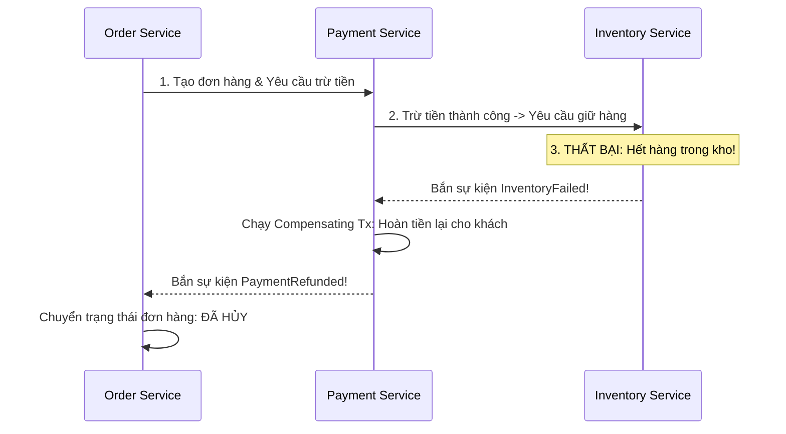

# Bài 4: Hệ Thống Phân Tán & Sự Đồng Thuận (Distributed Systems & Consensus)

> **Trọng tâm bài học:** Bản chất của Định lý CAP & Mở rộng PACELC; Thuật toán đồng thuận phân tán Raft; Giao dịch phân tán: Khóa hai pha (2PC - Two-Phase Commit) vs Saga Pattern (Choreography vs Orchestration); và kiến trúc Event Sourcing kết hợp CQRS.

---

## 1. Định Lý CAP & Mở Rộng PACELC

- **Định lý CAP (Eric Brewer):** Trong một hệ thống phân tán, khi xảy ra sự cố phân mảnh mạng (**P**artition Tolerance - đứt cáp quang giữa các data center), bạn **BẮT BUỘC CHỈ ĐƯỢC CHỌN 1 TRONG 2**:
  - **CP (Consistency + Partition Tolerance):** Ưu tiên tính nhất quán dữ liệu tuyệt đối. Nếu mạng bị đứt, hệ thống từ chối phục vụ (trả về lỗi) để ngăn chặn việc ghi dữ liệu mâu thuẫn (Ví dụ: Ngân hàng, Hệ thống thanh toán).
  - **AP (Availability + Partition Tolerance):** Ưu tiên độ sẵn sàng phục vụ. Hệ thống vẫn cho phép người dùng thao tác dù các data center đang mất liên lạc, chấp nhận dữ liệu có thể bị lệch tạm thời và sẽ đồng bộ sau (Ví dụ: Mạng xã hội, Feed tin tức, Lượt Like).

### Mở rộng PACELC:
Nếu có phân mảnh mạng (**P**artition), chọn giữa Độ sẵn sàng (**A**vailability) hay Nhất quán (**C**onsistency); **E**lse (Trong điều kiện mạng bình thường), chọn giữa Độ trễ thấp (**L**atency) hay Nhất quán cao (**C**onsistency).

---

## 2. Giao Dịch Phân Tán: 2PC vs Saga Pattern

Khi một thao tác nghiệp vụ cần cập nhật dữ liệu trên nhiều Microservices độc lập (ví dụ: Tạo đơn hàng $\rightarrow$ Trừ tiền ví $\rightarrow$ Trừ tồn kho kho hàng):

### 1. Two-Phase Commit (2PC):
- Sử dụng một bộ điều phối trung tâm (Coordinator) qua 2 bước: `Prepare` (Chuẩn bị và giữ Lock) và `Commit` (Xác nhận lưu).
- *Nhược điểm chết người:* Gây khóa giữ tài nguyên (Blocking locks) trên toàn bộ hệ thống, tắc nghẽn nghiêm trọng và không thể scale lớn.

### 2. Saga Pattern (Kiến Trúc Chuỗi Giao Dịch Bù Trừ):
Thay vì giữ Lock đồng bộ, Saga chia giao dịch lớn thành một chuỗi các giao dịch cục bộ (Local Transactions) tại từng service:
- Nếu Service A thành công, nó gửi sự kiện để Service B tiếp tục.
- Nếu Service C thất bại (ví dụ: Hết hàng trong kho), hệ thống sẽ kích hoạt một chuỗi các **Hành động bù trừ (Compensating Transactions)** chạy ngược lại: Hoàn lại tiền cho ví, hủy đơn hàng!

---

## 3. Event Sourcing & CQRS

- **Event Sourcing:** Thay vì chỉ lưu trạng thái hiện tại của đối tượng (ví dụ: `Balance = $500`), hệ thống lưu lại **toàn bộ lịch sử các sự kiện đã từng xảy ra** theo thứ tự thời gian (`AccountCreated`, `Deposited($1000)`, `Withdrew($500)`). Trạng thái hiện tại được tái tạo bằng cách phát lại (Replay) toàn bộ các sự kiện.
- **CQRS (Command Query Responsibility Segregation):** Tách bạch hoàn toàn mô hình Ghi (**Command:** INSERT/UPDATE/DELETE phục vụ nghiệp vụ) khỏi mô hình Đọc (**Query:** Đọc từ Read-optimized Views/Elasticsearch được đồng bộ bất đồng bộ).
