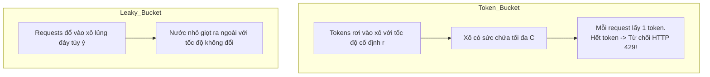
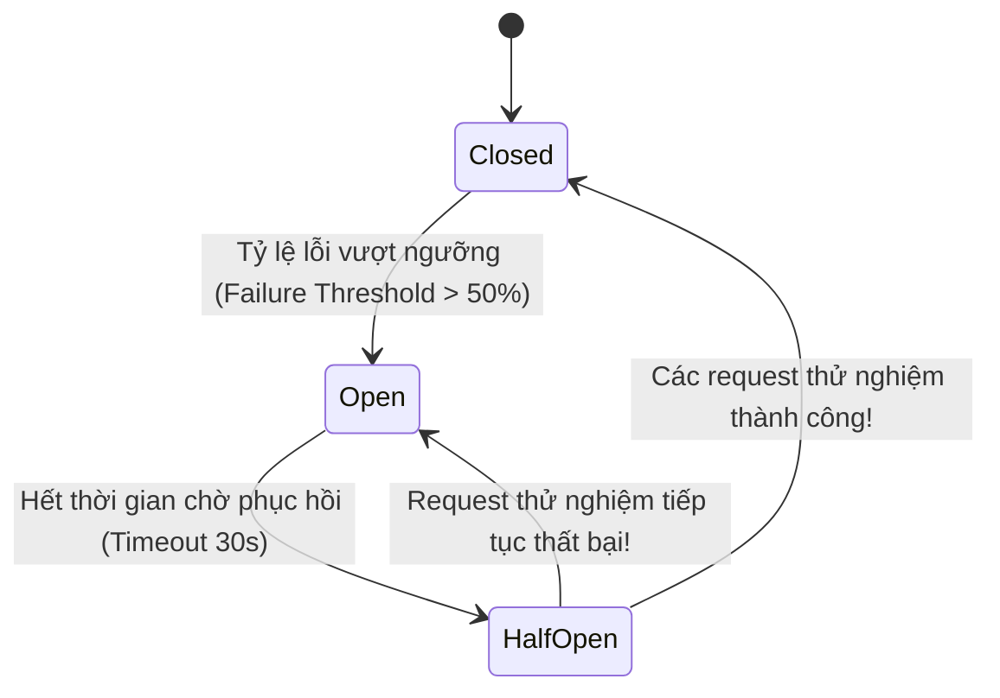

# Bài 5: Các Mẫu Thiết Kế Microservices & API (Patterns)

> **Trọng tâm bài học:** Giải phẫu các mẫu kiến trúc sống còn trong hệ thống Microservices: **API Gateway Pattern**, so sánh 4 thuật toán giới hạn tốc độ truy cập (**Rate Limiting**), cơ chế cầu dao tự ngắt (**Circuit Breaker**), Tính bất biến lặp lại (**Idempotency Key**), và mẫu xuất bản tin nhắn tin cậy **Transactional Outbox Pattern**.

---

## 1. Bốn Thuật Toán Giới Hạn Tốc Độ (Rate Limiting Algorithms)

Rate Limiter bảo vệ hệ thống khỏi các cuộc tấn công DDoS, bão lưu lượng (Traffic Spikes) và đảm bảo công bằng tài nguyên giữa các khách hàng:



| Thuật toán | Cơ chế hoạt động | Ưu điểm | Nhược điểm |
| :--- | :--- | :--- | :--- |
| **Token Bucket** | Tokens rơi vào xô với tốc độ $R$ tokens/giây, xô chứa tối đa $C$ tokens | **Hỗ trợ tốt các đợt bùng nổ lưu lượng ngắn (Traffic Bursts)** | Cần điều chỉnh 2 tham số: tốc độ nạp $R$ và dung lượng xô $C$ |
| **Leaky Bucket** | Request đổ vào hàng đợi FIFO, được rút ra xử lý với tốc độ ổn định tuyệt đối | Lưu lượng đầu ra luôn phẳng, không bị giật cục | Các request đến muộn có thể bị kẹt trong queue gây tăng độ trễ (Latency) |
| **Fixed Window Counter** | Đếm số request trong các khung thời gian cố định (ví dụ 100 req/phút từ 00:00 -> 00:01) | Rất đơn giản, tiết kiệm bộ nhớ | **Lỗi gấp đôi lưu lượng tại biên (Boundary Burst)**: 100 req cuối phút 1 + 100 req đầu phút 2 = 200 req trong 2 giây! |
| **Sliding Window Counter** | Trượt cửa sổ thời gian kết hợp tỷ trọng counter của cửa sổ trước và hiện tại | Khắc phục hoàn toàn lỗi biên, độ chính xác rất cao | Tốn bộ nhớ hơn một chút |

---

## 2. Circuit Breaker Pattern (Mẫu Cầu Dao Tự Ngắt)

Khi một dịch vụ phụ thuộc phía sau (Downstream Service) bị treo hoặc chết, nếu các service phía trước vẫn tiếp tục gửi request và chờ timeout 30 giây, toàn bộ luồng xử lý của hệ thống sẽ bị kẹt theo, gây ra hiệu ứng sụp đổ dây chuyền (Cascading Failure).



- **Closed (Đóng mạch):** Trạng thái bình thường. Mọi request đi qua thông suốt.
- **Open (Ngắt mạch):** Khi tỷ lệ lỗi vượt quá ngưỡng (ví dụ > 50% trong 10 giây qua), cầu dao **ngắt ngay lập tức**. Toàn bộ các request mới sẽ bị từ chối thẳng thừng (hoặc trả về dữ liệu fallback) trong vài mili-giây mà không cần gọi sang service đang chết!
- **Half-Open (Thử nghiệm):** Sau một khoảng thời gian chờ (ví dụ 30 giây), cầu dao cho phép một số lượng nhỏ request đi qua thử nghiệm. Nếu thành công, mạch đóng lại bình thường; nếu vẫn lỗi, ngắt mạch tiếp.

---

## 3. Transactional Outbox Pattern (Đảm Bảo Giao Dịch & Gửi Tin Nhắn Đồng Nhất)

Khi bạn muốn: Vừa lưu đơn hàng vào Database, vừa bắn một tin nhắn vào Kafka:
- Nếu lưu DB xong mà máy chủ sập trước khi bắn Kafka $\rightarrow$ Mất tin nhắn!
- Nếu bắn Kafka trước mà lệnh lưu DB bị rollback $\rightarrow$ Tin nhắn ma (Phantom message)!

### Giải pháp Transactional Outbox:
Thay vì gọi thẳng Kafka, hãy tạo thêm một bảng `OutboxTable` nằm **ngay trong cùng cơ sở dữ liệu**.
1. Trong 1 transaction CSDL cục bộ duy nhất:
   ```sql
   BEGIN TRANSACTION;
   INSERT INTO Orders (Id, Total) VALUES (1, 100);
   INSERT INTO OutboxMessages (Event, Payload) VALUES ('OrderCreated', '{...}');
   COMMIT;
   ```
2. Một tiến trình nền riêng biệt (Message Relay / Debezium CDC) sẽ đọc từ `OutboxMessages` để đẩy lên Kafka một cách an toàn và đảm bảo tính nhất quán tuyệt đối!
