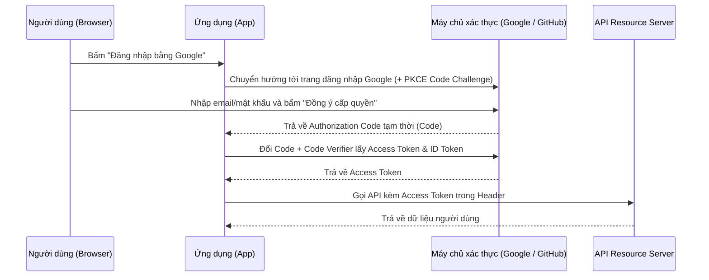

# Bài 6: Bảo Mật, Nhận Dạng & Mã Hóa (Security & Identity)

> **Trọng tâm bài học:** Phân biệt rạch ròi Mã hóa (Encryption) vs Băm (Hashing) vs Mã hóa định dạng (Encoding); Luồng xác thực phân quyền OAuth 2.0; So sánh Session-based vs JWT vs PASETO; và quy trình bắt tay an toàn HTTPS TLS 1.3 Handshake.

---

## 1. Phân Biệt: Encoding vs Hashing vs Encryption vs Tokenization

| Thuật ngữ | Mục đích cốt lõi | Có thể đảo ngược (Giải mã)? | Khóa bí mật (Key)? | Ví dụ tiêu biểu |
| :--- | :--- | :---: | :---: | :--- |
| **Encoding (Mã hóa định dạng)** | Đảm bảo tính toàn vẹn khi truyền dữ liệu qua các kênh mạng khác nhau | **Có** (Bất kỳ ai cũng giải mã được) | Không dùng khóa | Base64, ASCII, URL Encoding |
| **Hashing (Băm một chiều)** | Kiểm tra tính toàn vẹn, bảo vệ mật khẩu | **KHÔNG** (Thuật toán 1 chiều) | Không (hoặc có Salt) | SHA-256, BCrypt, Argon2id |
| **Encryption (Mã hóa bảo mật)** | Che giấu nội dung bí mật khỏi người lạ | **Có** (Chỉ người có khóa bí mật mới giải mã được) | Bắt buộc có khóa | AES-256, RSA, ECC |
| **Tokenization (Thay thế đại diện)** | Thay thế dữ liệu nhạy cảm bằng một chuỗi ngẫu nhiên không có giá trị toán học | **Có** (Chỉ tra cứu qua Token Vault an toàn) | Dùng bảng tra cứu (Vault) | Thẻ tín dụng Stripe Token |

---

## 2. Session-Based Authentication vs JSON Web Token (JWT)

```
+--------------------------------------------------------------------------+
| Session-Based (Stateful):                                                |
|   1. Client gửi User/Pass -> Server kiểm tra                             |
|   2. Server tạo Session ID, lưu vào RAM (Redis), gửi Cookie về Client    |
|   3. Mọi request sau: Server BẮT BUỘC phải tra cứu Redis để xác thực!     |
|   -> Ưu điểm: Hủy quyền (Revoke/Logout) ngay lập tức cực kỳ dễ dàng.     |
|   -> Nhược điểm: Phụ thuộc vào cụm Redis tập trung, khó scale toàn cầu.  |
+--------------------------------------------------------------------------+
| JWT - JSON Web Token (Stateless):                                        |
|   1. Server ký số bí mật (Digital Signature) vào chuỗi Token             |
|   2. Client tự giữ Token trong Header (Authorization: Bearer <token>)     |
|   3. Bất kỳ Microservice nào cũng tự xác thực được mà KHÔNG CẦN hỏi DB!  |
|   -> Ưu điểm: Phân tán tuyệt đối, hiệu năng cực cao, không tốn RAM server|
|   -> Nhược điểm: Rất khó thu hồi Token trước khi hết hạn (Trừ khi có     |
|      Blacklist hoặc dùng Refresh Token Rotation).                        |
+--------------------------------------------------------------------------+
```

---

## 3. Luồng Cấp Quyền OAuth 2.0 (Authorization Code Flow with PKCE)

OAuth 2.0 là chuẩn cấp quyền công nghiệp cho phép ứng dụng bên thứ ba (Client) truy cập tài nguyên của người dùng mà **không bao giờ biết mật khẩu** của người dùng.


