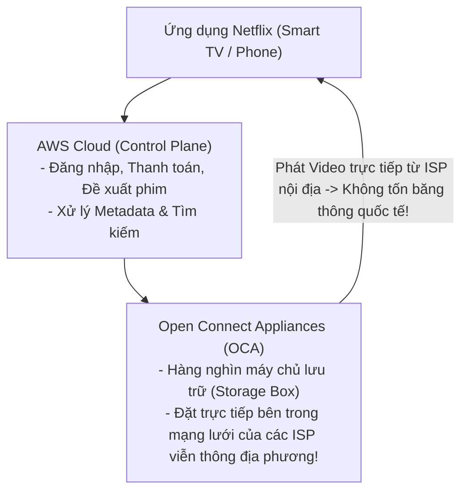

# Bài 7: Mổ Xẻ Kiến Trúc Hệ Thống Thực Tế (Real-World Case Studies)

> **Trực quan hóa từ ByteByteGo:** Phân tích kiến trúc kỹ thuật của các nền tảng công nghệ quy mô hàng tỷ người dùng: Đường ống xử lý video của **Netflix**, Cơ chế điều phối xe thời gian thực của **Uber**, Kiến trúc phòng chat thoại chịu tải hàng triệu người của **Discord**, và Thuật toán sinh ID phân tán **Twitter Snowflake**.

---

## 1. Netflix: Kiến Trúc Phân Phối Video Toàn Cầu (Open Connect CDN)

Netflix phục vụ hơn 15% tổng lưu lượng Internet toàn cầu nhưng không tự đặt máy chủ phát video tại trung tâm dữ liệu riêng:



- **Control Plane (AWS Cloud):** Quản lý tài khoản, thuật toán gợi ý phim, giao diện và thanh toán.
- **Data Plane (Open Connect):** Netflix tự chế tạo các máy chủ phần cứng chuyên dụng (Open Connect Appliances - OCA) và tặng miễn phí cho các nhà mạng (ISP như Viettel, VNPT, Comcast) để đặt trực tiếp ngay tại các trạm trung chuyển địa phương. Video được truyền từ khoảng cách chỉ vài km tới nhà người dùng!

---

## 2. Uber: Hệ Thống Định Vị & Điều Phối Xe Thời Gian Thực (DISCO & H3)

### Vấn đề:
Làm thế nào để ghép nối một tài xế gần nhất với hành khách trong số hàng triệu tài xế đang liên tục di chuyển và cập nhật tọa độ GPS mỗi 4 giây?
- Nếu dùng phép tính khoảng cách Euclid thông thường: $O(N)$ quét toàn bộ tài xế trên toàn thế giới $\rightarrow$ Sập máy chủ!

### Giải pháp: Lưới Lục Giác H3 (Hexagonal Hierarchical Spatial Index)
- Uber chia toàn bộ bề mặt Trái Đất thành các **ô lục giác lồng nhau (H3 Hexagons)**.
- Mỗi ô lục giác có một mã số định danh nguyên 64-bit (`H3Index`).
- Khi tài xế gửi tọa độ GPS, Uber chỉ cần xác định tài xế đang nằm trong ô lục giác nào.
- Khi hành khách đặt xe: Uber chỉ cần tìm trong ô lục giác của khách và 6 ô lục giác lân cận (k-ring). Độ phức tạp giảm từ $O(N)$ xuống $O(1)$!

---

## 3. Twitter Snowflake: Thuật Toán Sinh Khóa Phân Tán Độc Nhất

Làm thế nào để sinh hàng triệu ID duy nhất mỗi giây trên hàng trăm máy chủ mà không bị trùng lặp, không cần khóa tập trung (No Centralized Lock), và ID có thể tự sắp xếp theo thời gian (Time-sortable)?

```
+-------------------------------------------------------------------------+
| Twitter Snowflake ID: Số nguyên 64-bit (long)                           |
+---------+------------------------------+--------------------+-----------+
| 1 bit   | 41 bits                      | 10 bits            | 12 bits   |
| Không   | Timestamp (Mili-giây tính    | Machine ID /       | Sequence  |
| dùng    | từ mốc Epoch tùy biến)       | Data Center ID     | Number    |
| (Luôn 0)| -> Dùng được trong 69 năm!   | (Tối đa 1024 máy)  | (0 - 4095)|
+---------+------------------------------+--------------------+-----------+
```
- **41 bits Timestamp:** Cho phép sắp xếp các bài viết/tweet theo đúng thứ tự thời gian tự nhiên mà không cần cột `created_at`.
- **10 bits Machine ID:** Đảm bảo 1024 máy chủ chạy song song không bao giờ sinh trùng ID của nhau.
- **12 bits Sequence:** Cho phép một máy chủ sinh tối đa **4,096 ID duy nhất trong cùng 1 mili-giây** (tương đương 4 triệu IDs/giây trên 1 máy!).
