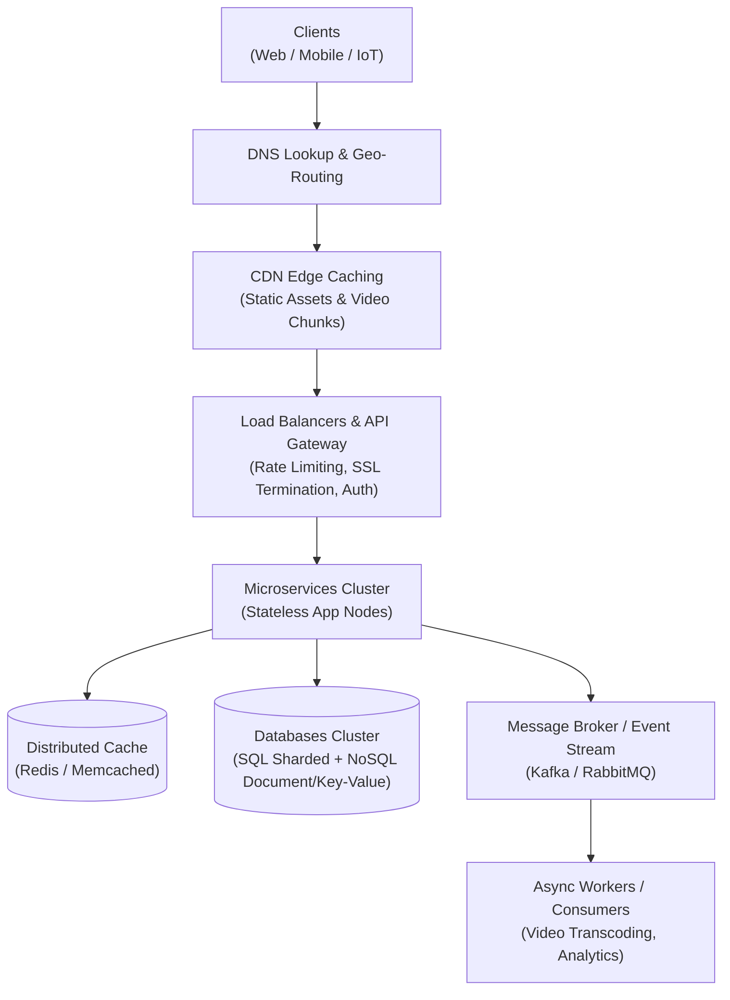

# ByteByteGo: System Design 101 - Cẩm Nang Trực Quan Hóa Hệ Thống Phân Tán

> **Tài liệu được trích xuất, biên soạn và chuẩn hóa từ dự án kinh điển [ByteByteGoHq/system-design-101](https://github.com/ByteByteGoHq/system-design-101) của tác giả Alex Xu (tác giả bộ sách bán chạy toàn cầu *System Design Interview*).**

Hệ thống kiến trúc phân tán quy mô lớn được cô đọng dưới dạng các biểu đồ trực quan, phân tích so sánh bản chất (Trade-offs) và các mẫu thiết kế thực tế từ các tập đoàn công nghệ hàng đầu (Netflix, Uber, Discord, Amazon, YouTube).

---

## 🗺️ Bản Đồ Kiến Trúc Hệ Thống Tổng Thể

---

## 📑 Danh Mục Các Chủ Đề Chuyên Sâu

| Chủ đề | Tài liệu chi tiết | Trọng tâm phân tích & Trực quan hóa |
| :--- | :--- | :--- |
| **01. Giao Thức Mạng** | **[01-communication-protocols.md](file:///d:/my-project/revision-document/system-design/bytebytego-101/01-communication-protocols.md)** | So sánh chuyên sâu: REST vs GraphQL vs gRPC vs WebSocket; HTTP 1.1 vs HTTP/2 vs HTTP/3 (QUIC/UDP); Bắt tay TCP 3 chiều vs UDP; Trực quan hóa gói tin. |
| **02. Cơ Sở Dữ Liệu** | **[02-databases-and-storage.md](file:///d:/my-project/revision-document/system-design/bytebytego-101/02-databases-and-storage.md)** | SQL vs NoSQL; Cấu trúc Index: B-Tree (Read-heavy) vs LSM-Tree (Write-heavy); Sharding chiến lược; Nhân bản Single-leader vs Multi-leader; ACID vs BASE. |
| **03. Caching & Tốc Độ** | **[03-caching-and-performance.md](file:///d:/my-project/revision-document/system-design/bytebytego-101/03-caching-and-performance.md)** | Các tầng Caching; Chiến lược: Cache-aside, Read-through, Write-through, Write-behind; Xử lý sự cố: Cache Avalanche, Cache Breakdown, Cache Stampede (Bloom Filter). |
| **04. Hệ Thống Phân Tán** | **[04-distributed-systems-and-consensus.md](file:///d:/my-project/revision-document/system-design/bytebytego-101/04-distributed-systems-and-consensus.md)** | Định lý CAP & PACELC; Đồng thuận phân tán (Raft, Paxos); Giao dịch phân tán: 2PC vs Saga (Choreography vs Orchestration); Event Sourcing & CQRS. |
| **05. Microservices & API** | **[05-api-and-microservices-patterns.md](file:///d:/my-project/revision-document/system-design/bytebytego-101/05-api-and-microservices-patterns.md)** | API Gateway; 4 thuật toán Rate Limiter (Token Bucket, Leaky Bucket, Fixed Window, Sliding Window Log/Counter); Circuit Breaker; Idempotency Key; Transactional Outbox. |
| **06. Bảo Mật & Định Danh** | **[06-security-and-identity.md](file:///d:/my-project/revision-document/system-design/bytebytego-101/06-security-and-identity.md)** | Luồng xác thực OAuth 2.0; Session-based vs JWT vs PASETO; SSO (Single Sign-On); Mã hóa đối xứng vs bất đối xứng; Bắt tay HTTPS TLS 1.3. |
| **07. Kiến Trúc Thực Tế** | **[07-real-world-case-studies.md](file:///d:/my-project/revision-document/system-design/bytebytego-101/07-real-world-case-studies.md)** | Mổ xẻ kiến trúc các hệ thống lớn: Netflix Streaming Pipeline, Uber Real-time Geospatial Dispatch, Discord 11 Million Voice Users, Twitter Snowflake ID. |
